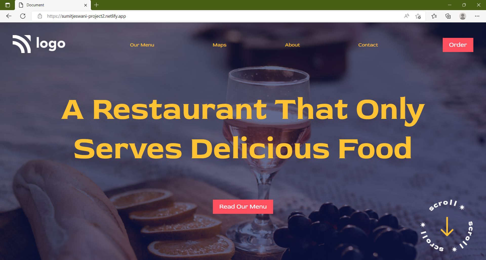

# Restaurant Landing page

>Hello everyone, I am Sumit and I have recently started learning Web Development. This is my secound web page built using HTML and CSS. Currently, this project is not responsive and works only on the laptop screen.

## Sneak peek

## Learnings

- Selectors, Positions, and alignments
- Working with background images

## Time to finish the project
- 2 hours

## Live Link
[https://sumitjeswani-project2.netlify.app/](https://sumitjeswani-project2.netlify.app/ "Landing Page 1")

